## Инструкция по настройке рабочего окружения
Здесь мы настроем наш репозиторий, докер образ, а также среду разработки.

## Установка Visual Studio Code
    Среда разработки (IDE) 
1. Перейдите на официальный сайт: https://code.visualstudio.com/
2. Нажмите кнопку "Download for Windows"
3. Запустите скачанный установщик
4. Оставьте все предложенные галочки.
5. Нажмите "Установить" и дождитесь завершения

## Установка Docker Desktop
    Данное приложение позволяет запускать виртуальные окружения на Windows 

1. Перейдите на https://www.docker.com/products/docker-desktop
2. Нажмите "Download for Windows - AMD64" 

    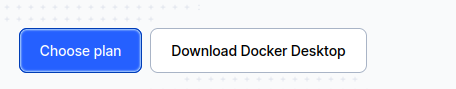
3. Запустите Docker Desktop Installer.exe
4. Убедитесь, что опция "Use WSL 2 instead of Hyper-V" отмечена (рекомендуется)
    
    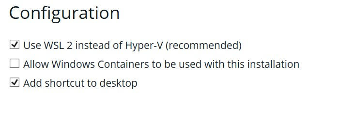
5. Следуйте инструкциям установщика. Установка может занять 10-15 минут.
6. После установки перезагрузите компьютер
7. Запустите Docker Desktop
8. Примите условия соглашения
9. Залогиньтесь (рекомендуется)
    
    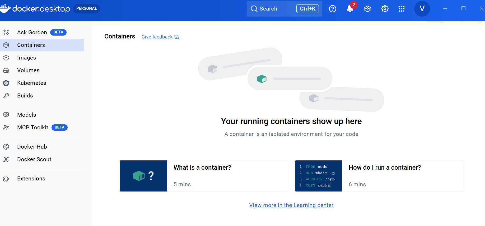

## Настройка Github
### Регистрация и настройка удалённего репозитория (репо)
1. Перейдите на https://github.com/
2. Если нет аккаунта, зарегистрируйтесь. Лучше указать страну, отличную от России. Github может банить российские аккаунты.
    
    
3. Переходим в учебный репозиторий https://github.com/VasilyMarkov/Learn_cpp
4. Необходимо сделать fork учебного репозитория. Нажимаем на кнопку fork.
    
    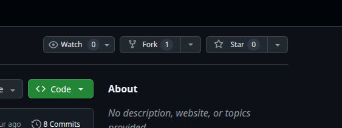
5. В следующем окне оставляем всё как есть и нажимаем **Create fork**
6. После этого будет открыта страница вашей копии репозитория

    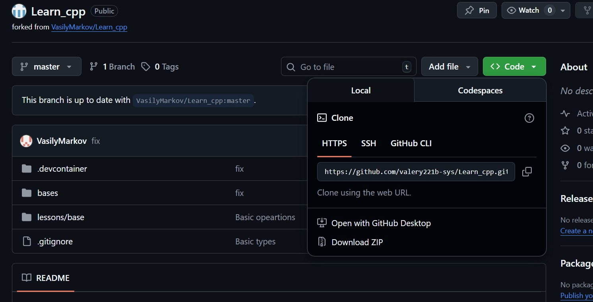

### Загрузка локального репозитория
1. В окне вашего форка нажмите кнопку **Code**. Выберете **HTTPS** и скопируйте ссылку репозитроия.
2. В Windows выберете директорию, куда вы хотите скачать репо. Откройте в данной папке консоль. Для этого впишите **cmd** в адресную строчку.

    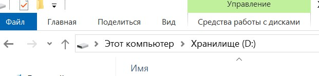
3. В открывшейся консоли впишите `git clone <ваш репозиторий>`. После этого будет загружен ваш репозиторий. Появится папка **Learn cpp**.

## Настройка докера
1. Запустите **Vscode**. Нажмите **Open Folder** и выберете папку вашего репозитория **Learn cpp**.

    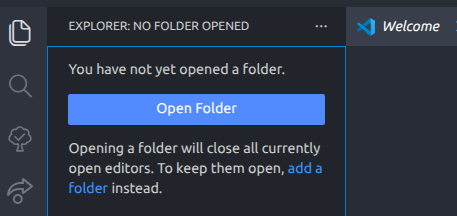
2. После этого справа снизу появится окно для сборки докера. Нажимаем **Reopen in Container**.

    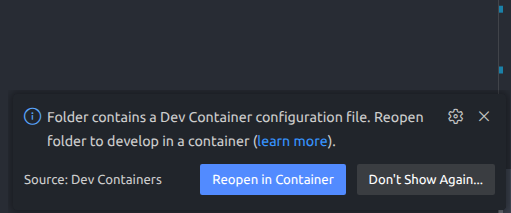
3. Начнется процесс сборки докера. Будет такое сообщение. Процесс может длиться до 10 минут.
    
    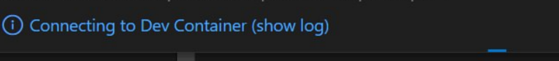

4. После сборки можно будет увидеть текущий статус образа. На данный момент докер образ успешно собран и настроен. Это означет, что **vscode** работает в докере. На данный момент в ней предустановлено несколько расширений. Далее можно самостоятельно настроить среду под себя. 

    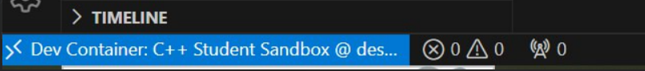
5. Для проверки работоспособности необходимо открыть терминал. Далее написать команду: `clang++ base/main.cpp && ./a.out`. После этого должно появиться сообщение в консоли: `Hello, World!`. 

    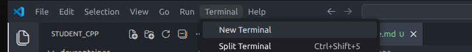

    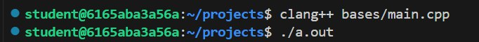

### Проект настроен.